# Avatar Game By MG

> This project backend in github repository:
> [https://github.com/Mglenn23/backend-phase2-project](https://github.com/Mglenn23/backend-phase2-project)

Avatar game front end created using react, bootstrap, css, sweetalert2. backend using sinatra ruby. To play this game, the player needs to register their account for login. Player need to choose pick element or direct attack. If player choose pick element, random element and status opponent will show up. If the random element is same with player/enemy element, attack power +200. Player have 100hp maximum and each time win, player get +10hp, each lose -20hp. To win the game, by compare attack power player with enemy.

## Table of Contents

- [General Info](#general-information)
- [Tools Used](#tools-used)
- [Features](#features)
- [Screenshots](#screenshots)
- [Room for Improvement](#room-for-improvement)
- [Acknowledgements](#acknowledgements)
- [Contact](#contact)

## General Information

- One page load without refresh the page, using react-router
- Create, update, delete card data
- Backend use sinatara ruby on rails
- Leaderboard game
- Simple design website with interactive game play with Enemy

## Tools Used

- Bootstrap - https://react-bootstrap.github.io/
- Sweetalert2 - https://sweetalert2.github.io/recipe-gallery/sweetalert2-react.html

## Features

List the ready features here:

- Play with Enemy
- Players leaderboard(how many win, lose, draw & play time)
- Choose element and attack

## Screenshots

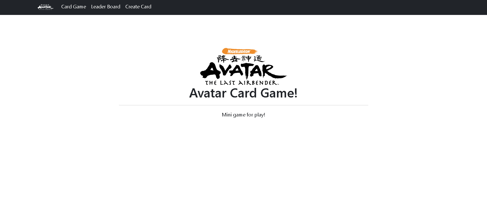
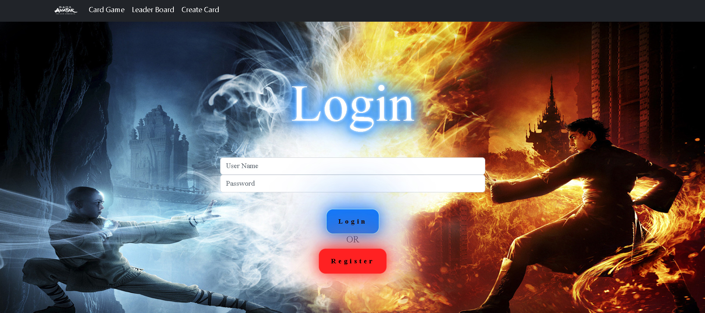

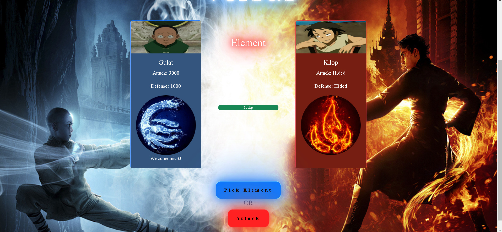
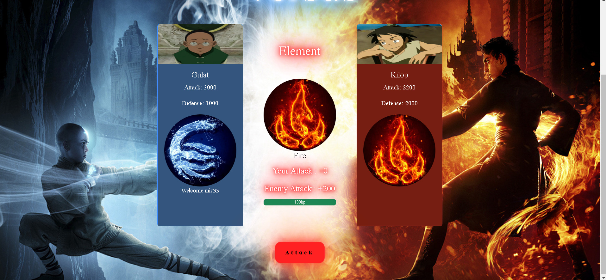
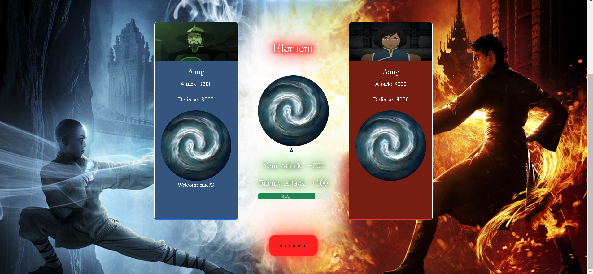
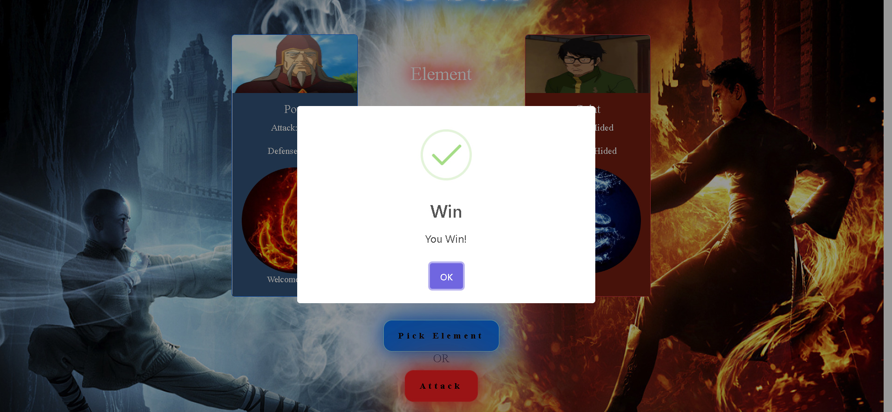
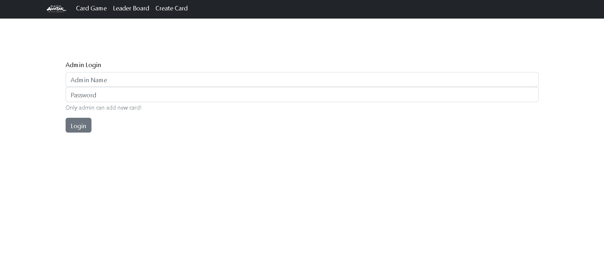
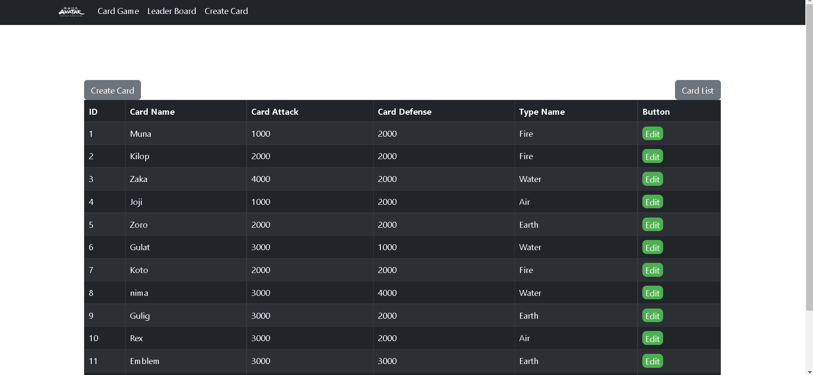
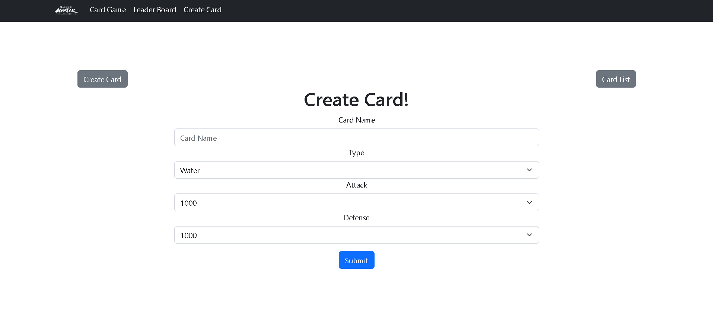
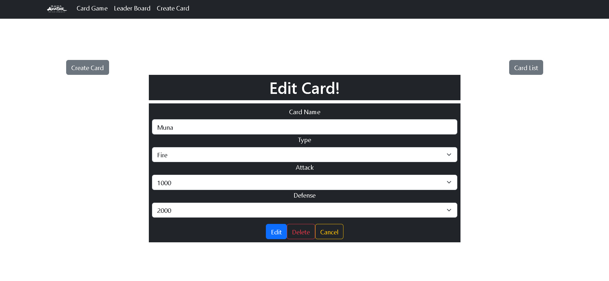
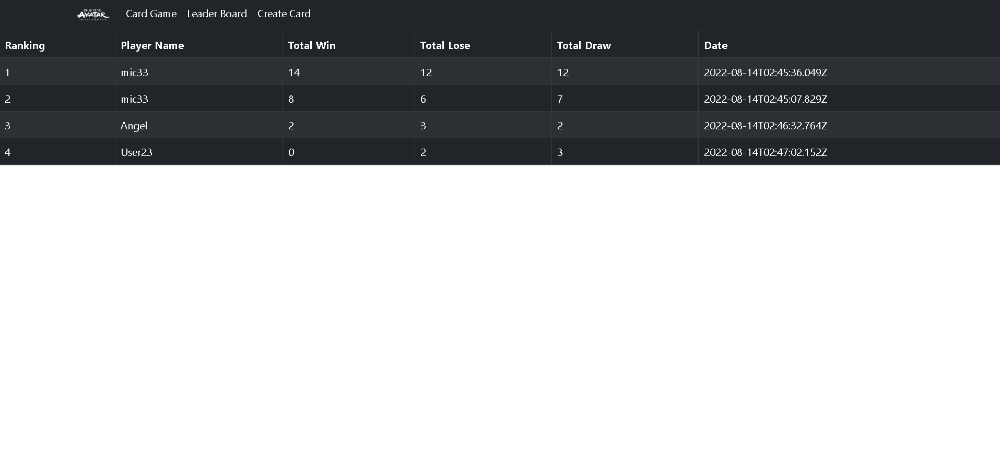

## Room for Improvement

There is a plan for improvement with this project, to make this game more interactive.

Room for improvement:

- Improvement to be done attack power compare with defend power
- Improvement to be done more feature with element
- Improvement to be done more challange for player to choose

## Acknowledgements

- This project was inspired by my childhood movie avatar the legend of Aang.
- Many thanks to my Flatiron school lectures
- This is my phase3 project at Flatiron school

## Contact

Created by [@mg](https://www.linkedin.com/in/michael-gunawan-030a52194/) - feel free to contact me!
